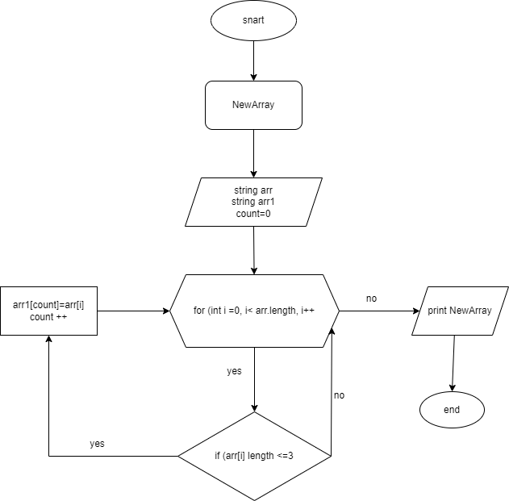

1. Задаём массив.
2. Объявляем ввод значений в строку первого массива через запятую.
3. Задаём второй массив такой же длинны что и первый.
4. Создаём метод 
5. Cоздаём переменную count в которую будет заноситься результат действия цикла проверки условия (длинна элемента массива <=3) если условие выполняется то элемент первого массива заносится в переменную и становиться элементом второго массива.
6. После переменную count увеличиваем на единицу.
7. Возвращаемся к циклу увеличиваем i на единицу и проверяем следующий элемент. И так до окончания элементов массива.
8. После чего выводим в консоль второй массив заполненный элементами которые <=3 символам.

# Блок Схема 

